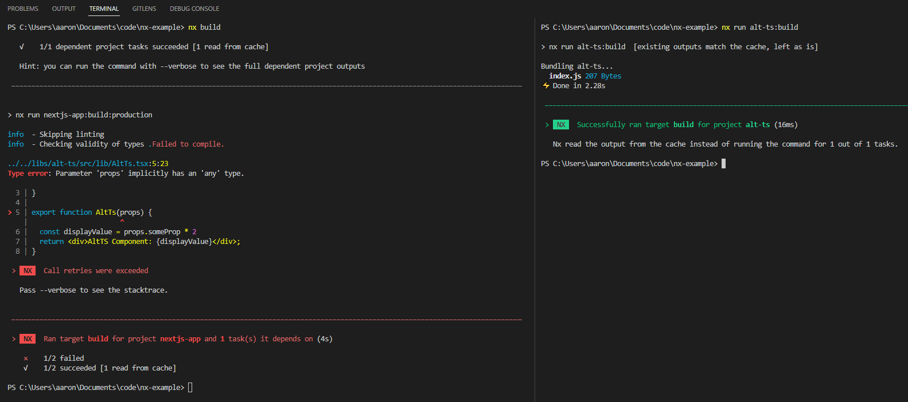

# Nx Issue
I believe the `buildLibsFromSource` rule on the `@nrwl/next:build` executor is being ignored. This repo contains 2 Nx packages, each with different typescript configs

Steps to reproduce:
1. clone this repo
2. run `npm i` to install node_modules
3. run `nx run alt-ts:build` to successfully build the library
4. run `nx build` to build both packages. The alt-ts reads from cache successfully, but `nextjs-app` throws an error in the `../../libs/alt-ts/src/lib/AltTs.tsx:5:23` file due to the implicit any rule (allowed in `alt-ts`, not allowed in `nextjs-app`). I think this means its rebuilding the alt-ts library using nextjs-app's tsconfig

## Screenshot of terminal outputs

